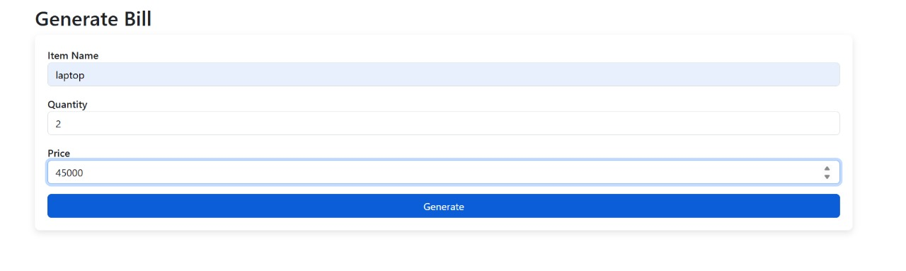

# Bill Generating Web App 

This is a simple **Flask-based web app** that allows users to generate a bill summary based on item name, quantity, and price.

---

## 🔧 Technologies Used
- Python 3
- Flask 2.3.3
- HTML/CSS

---

## Screenshots

### Input Page

### Output Page

