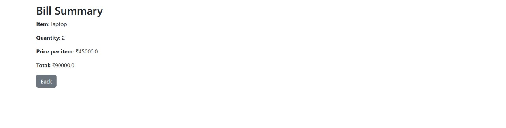

# Bill Generating Web App 💰

This is a simple **Flask-based web app** that allows users to generate a bill summary based on item name, quantity, and price.

---

## 🔧 Technologies Used
- Python 3
- Flask 2.3.3
- HTML/CSS

---

## 📸 Screenshots

### 🖊 Input Page


### ✅ Output Page


---

## 🚀 How to Run

1. Install dependencies:
    ```
    pip install -r requirements.txt
    ```

2. Run the app:
    ```
    python app.py
    ```

3. Open browser and go to:
    ```
    http://localhost:5000
    ```

---

## 🗂 Project Structure

